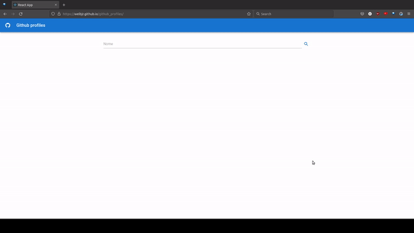

# Apresentação

Aplicação simples que usa a API do Github. Link: https://welbjr.github.io/github_profiles/



# Instalação

1. Instale as dependências:

```sh
npm install
```

2. Crie um arquivo .env com as seguintes variáveis:

```
REACT_APP_CLIENT_ID=xxxx
REACT_APP_CLIENT_SECRET=xxxxxxx
```

_obs: é possivel usar um token do github no secret. Docs: <https://docs.github.com/en/authentication/keeping-your-account-and-data-secure/creating-a-personal-access-token>_

3. Inicie o projeto:

```sh
npm run start
```
